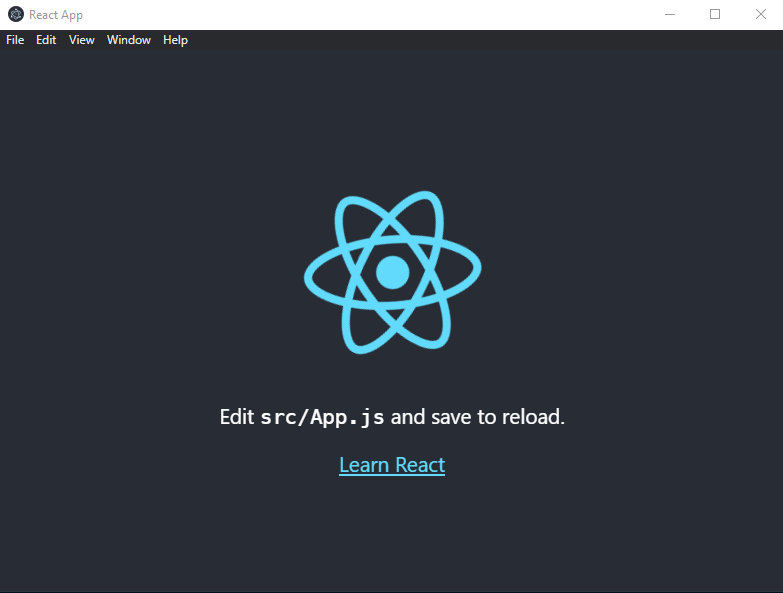

# React Electron simple start boilerplate

Author: [Thierry Brouet](https://github.com/thierryDev62)
<br>
Contributor: [Sebastien Vermelle](https://github.com/Fyfres)
<br>
Find me on Linkedin : [https://www.linkedin.com/in/thierry-brouet-481498192/](https://www.linkedin.com/in/thierry-brouet-481498192/)
<br>
<br>
[](https://forthebadge.com)
<br>
2021 - Barlin (France)
<br>
<br>
About :
<br>
- The marvellous Javascript's library React: [https://reactjs.org](https://reactjs.org)
- The wonderful cross-platform desktop apps with JavaScript, HTML, and CSS builder Electron: [https://www.electronjs.org/](https://www.electronjs.org/)

## Install
First, clone the repo via git and install dependencies:

```bash
git clone --depth 1 --single-branch https://github.com/thierryDev62/react-electron.git your-project-name
cd your-project-name
yarn
```

## Starting Development

Start the app in the `dev` environment:

```bash
yarn serve
```

## Build app (Windows only)

```bash
yarn build
```
<br>

## Final render
<br>

<br>
Enjoy! &#10084;
